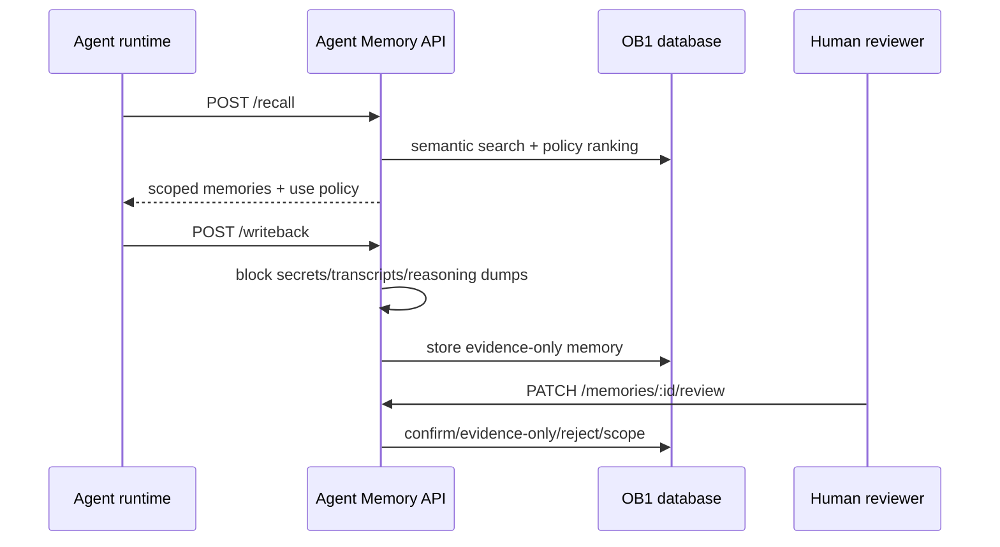

# Agent Memory API

> Runtime-neutral recall, write-back, review, inspection, and trace API for OB1 Agent Memory.



## What It Does

This Edge Function exposes the v1 OB1 Agent Memory contract. OpenClaw is the first launch runtime, but these endpoints are runtime-neutral and can be used by Codex, Claude Code, local agents, n8n, or future SQLite adapters.

## Prerequisites

- Working Open Brain setup ([guide](../../docs/01-getting-started.md))
- [`schemas/agent-memory`](../../schemas/agent-memory/) applied
- Supabase CLI installed
- `OPENROUTER_API_KEY` and `MCP_ACCESS_KEY` configured as Supabase secrets
- For shared or production read-only deployments, `AGENT_MEMORY_READ_ONLY=true`,
  `AGENT_MEMORY_ALLOWED_WORKSPACE_ID`, and `AGENT_MEMORY_ALLOWED_PROJECT_ID`
  configured before endpoint verification.

## Credential Tracker

```text
AGENT MEMORY API -- CREDENTIAL TRACKER
--------------------------------------

FROM YOUR OPEN BRAIN SETUP
  Supabase Project ref:       ____________
  MCP Access Key:             ____________
  OpenRouter API Key:         ____________

GENERATED DURING SETUP
  Agent Memory API URL:       ____________
  Agent Memory API URL + key: ____________

--------------------------------------
```

## Steps


Apply [`schemas/agent-memory/schema.sql`](../../schemas/agent-memory/schema.sql).

**Done when:** the `agent_memories` and `agent_memory_recall_traces` tables exist.


Copy this folder into your Supabase project:

```bash
supabase functions new agent-memory-api
cp integrations/agent-memory-api/index.ts supabase/functions/agent-memory-api/index.ts
cp integrations/agent-memory-api/deno.json supabase/functions/agent-memory-api/deno.json
cp integrations/agent-memory-api/auth.ts supabase/functions/agent-memory-api/auth.ts
cp integrations/agent-memory-api/policy.ts supabase/functions/agent-memory-api/policy.ts
cp integrations/agent-memory-api/read-only.ts supabase/functions/agent-memory-api/read-only.ts
supabase functions deploy agent-memory-api --no-verify-jwt
```

The integration source folder is authoritative. Do not deploy a stale
materialized `supabase/functions/agent-memory-api` copy unless it has been
resynchronized with `index.ts`, `auth.ts`, `policy.ts`, `read-only.ts`, and
`deno.json`.

Before deploying from a materialized package, run the package sync check:

```bash
node integrations/agent-memory-api/check-supabase-package-sync.mjs
```

The check intentionally compares only runtime files. Tests, docs, smoke
harnesses, metadata, and `deno.lock` stay in this integration folder unless a
separate deployment-snapshot policy says otherwise.

**Done when:** `supabase functions list` shows `agent-memory-api` as active.


```bash
curl "https://YOUR_PROJECT_REF.supabase.co/functions/v1/agent-memory-api/health" \
  -H "x-brain-key: YOUR_MCP_ACCESS_KEY"
```

**Done when:** the response includes `"ok": true`.

## API Surface

The API accepts the runtime-neutral core schema versions and the OpenClaw launch aliases:

| Contract | Runtime-Neutral | OpenClaw Alias |
| -------- | --------------- | -------------- |
| Recall request | `openbrain.agent_memory.recall.v1` | `openbrain.openclaw.recall.v1` |
| Recall response | `openbrain.agent_memory.recall_response.v1` | `openbrain.openclaw.recall_response.v1` |
| Write-back request | `openbrain.agent_memory.writeback.v1` | `openbrain.openclaw.writeback.v1` |
| Write-back response | `openbrain.agent_memory.writeback_response.v1` | `openbrain.openclaw.writeback_response.v1` |

| Endpoint | Method | Purpose |
| --- | --- | --- |
| `/health` | GET | Verify deployment |
| `/recall` | POST | Retrieve scoped memories before work starts |
| `/writeback` | POST | Save compact operational memory after work finishes |
| `/recall/:request_id/usage` | POST | Report which recalled memories were used or ignored |
| `/memories` | GET | List memories by workspace, project, status, runtime, type, or task prefix |
| `/memories/review` | GET | List pending agent-written memories |
| `/memories/:id` | GET | Inspect one memory with source/artifact details |
| `/memories/:id/review` | PATCH | Confirm, edit, reject, restrict, stale, dispute, or supersede |
| `/recall-traces/:request_id` | GET | Debug what was recalled and how it was used |

## Auth And Scope Boundary

Requests authenticate with either `x-brain-key: ...` or
`Authorization: Bearer ...`. Query-string key auth is disabled by default
because URLs can be logged by terminals, proxies, browsers, and screenshots.
Only enable `AGENT_MEMORY_ALLOW_QUERY_KEY=true` for local throwaway testing.

When `AGENT_MEMORY_ALLOWED_WORKSPACE_ID` or
`AGENT_MEMORY_ALLOWED_PROJECT_ID` is set, the API returns `403
scope_not_allowed` for out-of-scope requests. This app-level check matters
because the Edge Function uses a service-role database client. ID-based reads
also check the returned row's workspace/project, so a known memory ID or recall
trace ID cannot bypass the approved scope.

## Expected Outcome

An agent runtime can recall relevant context, write back compact memories, and leave a trace that explains what happened. Unsafe write-backs are blocked before durable storage.

The trust model is documented in [Safe Agent Memory and Provenance](../../docs/safe-agent-memory-provenance.md).

## Smoke Harness

Use the live smoke harness after deploying the Edge Function or rotating secrets:

```bash
OB1_AGENT_MEMORY_ENDPOINT="https://YOUR_PROJECT_REF.supabase.co/functions/v1/agent-memory-api" \
OB1_AGENT_MEMORY_KEY="YOUR_MCP_ACCESS_KEY" \
OB1_AGENT_MEMORY_WORKSPACE_ID="ob1-staging" \
OB1_AGENT_MEMORY_PROJECT_ID="agent-memory-api-smoke" \
node integrations/agent-memory-api/smoke/live-smoke.mjs
```

The stock live smoke harness is intentionally write-heavy. Do not use it for read-only staging lanes. If `OB1_AGENT_MEMORY_READ_ONLY=true` or `AGENT_MEMORY_READ_ONLY=true` is present, the harness exits before any endpoint call.

The harness checks health, write-back policy defaults, conservative recall gating, include-unconfirmed recall, usage reporting, review action, memory inspection, recall trace, and unsafe write-back blocking. It prints a JSON summary and never prints the access key.

For read-only staging lanes, use the dedicated read-only smoke harness. It defaults to dry-run mode and does not call endpoints unless `--execute` is set.

```bash
node integrations/agent-memory-api/smoke/read-only-smoke.mjs
```

Live execute mode is approval-gated and requires explicit read-only posture:

```bash
AGENT_MEMORY_READ_ONLY=true \
AGENT_MEMORY_ALLOWED_WORKSPACE_ID="humestone-agent-memory-staging" \
AGENT_MEMORY_ALLOWED_PROJECT_ID="phase-8c-readonly-smoke" \
OB1_AGENT_MEMORY_ENDPOINT="https://YOUR_PROJECT_REF.supabase.co/functions/v1/agent-memory-api" \
OB1_AGENT_MEMORY_KEY="YOUR_MCP_ACCESS_KEY" \
OB1_AGENT_MEMORY_WORKSPACE_ID="humestone-agent-memory-staging" \
OB1_AGENT_MEMORY_PROJECT_ID="phase-8c-readonly-smoke" \
node integrations/agent-memory-api/smoke/read-only-smoke.mjs --execute
```

The read-only harness checks header and Bearer auth, read-only empty-state endpoints, out-of-scope scope rejection, and blocked write endpoints (`/recall`, `/writeback`, `/recall/:request_id/usage`, `/memories/:id/review`). It uses empty payload probes for write endpoints so the harness still avoids write-capable payloads if the API is misconfigured.

For personal databases, use the cleanup harness to find or reject smoke/test memories without deleting rows:

```bash
OB1_AGENT_MEMORY_ENDPOINT="https://YOUR_PROJECT_REF.supabase.co/functions/v1/agent-memory-api" \
OB1_AGENT_MEMORY_KEY="YOUR_MCP_ACCESS_KEY" \
OB1_AGENT_MEMORY_WORKSPACE_ID="ob1-staging" \
OB1_AGENT_MEMORY_TEST_PROJECT_IDS="agent-memory-api-smoke,agent-memory-openclaw-smoke" \
node integrations/agent-memory-api/smoke/cleanup-test-memory.mjs
```

The default mode is dry-run. Add `--apply` to mark matching active test memories as `rejected`. The harness refuses project IDs that do not look like smoke/test/sandbox scopes.

## Local Hardening Notes

- `AGENT_MEMORY_READ_ONLY=true` blocks write-capable routes before payload validation: `POST /recall`, `POST /writeback`, `POST /recall/:request_id/usage`, and `PATCH /memories/:id/review`.
- `AGENT_MEMORY_ALLOWED_WORKSPACE_ID` and `AGENT_MEMORY_ALLOWED_PROJECT_ID` constrain both query-scoped reads and ID-based reads.
- `x-brain-key` and `Authorization: Bearer` are supported. Query-string key auth is opt-in only through `AGENT_MEMORY_ALLOW_QUERY_KEY=true`.
- Recall returns no memories when semantic search returns no candidate thought IDs. It does not fall back to recent workspace memories.
- Visibility rules are explicit: personal memories require personal recall, channel memories require the matching channel, project memories respect `project_only`, workspace memories can appear in project/workspace recall, and organization memories require organization visibility.
- `merge` marks the current memory as merged and relates it to the target with `merged_into`.
- `supersede` treats the current memory as the replacement and marks the related older memory as superseded.

## Troubleshooting

**Issue: `Invalid or missing access key`**
Solution: Confirm the request includes `x-brain-key` or `Authorization: Bearer`. Avoid `?key=` URLs except in local throwaway testing with `AGENT_MEMORY_ALLOW_QUERY_KEY=true`.

**Issue: recall returns no memories**
Solution: Confirm write-back has created `agent_memories`, and that those memories are confirmed or `include_unconfirmed` is true.

**Issue: write-back blocked as unsafe**
Solution: Store a compact summary and artifact links. Do not submit raw transcripts, reasoning traces, secrets, or large code blocks.

## Tool Surface Area

This integration exposes an API that plugins can wrap as tools. See the [MCP Tool Audit & Optimization Guide](../../docs/05-tool-audit.md) before adding additional runtime-specific tool surfaces.
